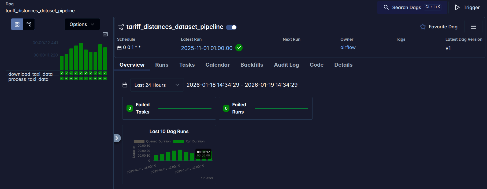
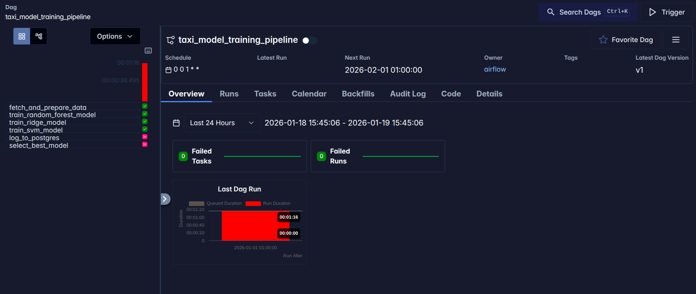
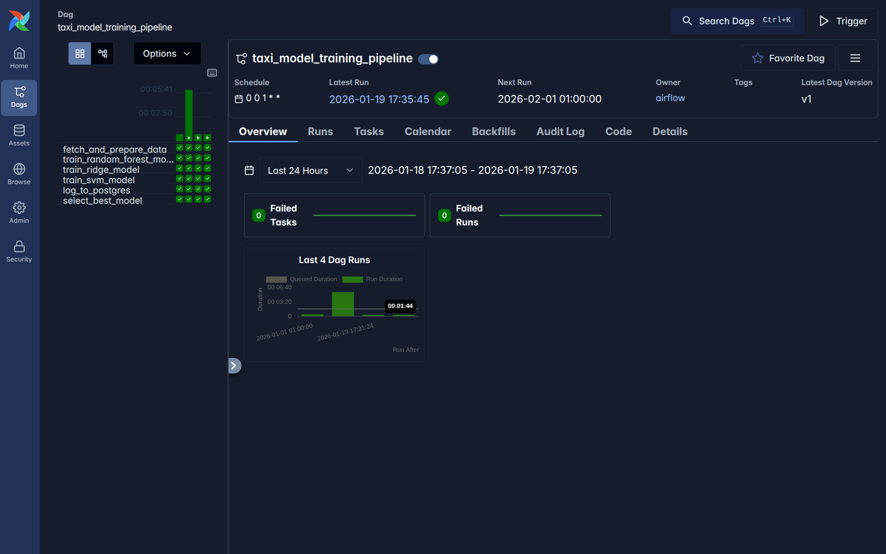

# Homwework 12

## 1. Setup new airflow

## 2. Running First Dag



### Check if saved files exists

```bash
jerzy-boksa@jerzyb-laptop:~/Programming/Projects/university/term_3/mlops_agh_course/homework12$ aws --endpoint-url=http://localhost:4566 s3 ls s3://tariff-distances --recursive
2026-01-19 14:32:38       6343 processed/daily_taxi_data_2024-01.parquet
2026-01-19 14:32:38       6196 processed/daily_taxi_data_2024-02.parquet
2026-01-19 14:32:38       6345 processed/daily_taxi_data_2024-03.parquet
2026-01-19 14:33:04       6274 processed/daily_taxi_data_2024-04.parquet
2026-01-19 14:32:59       6356 processed/daily_taxi_data_2024-05.parquet
2026-01-19 14:33:04       6279 processed/daily_taxi_data_2024-06.parquet
2026-01-19 14:33:11       6351 processed/daily_taxi_data_2024-07.parquet
2026-01-19 14:33:27       6350 processed/daily_taxi_data_2024-08.parquet
2026-01-19 14:33:27       6290 processed/daily_taxi_data_2024-09.parquet
2026-01-19 14:33:31       6345 processed/daily_taxi_data_2024-10.parquet
2026-01-19 14:33:45       6282 processed/daily_taxi_data_2024-11.parquet
2026-01-19 14:33:51       6353 processed/daily_taxi_data_2024-12.parquet
2026-01-19 14:33:53       6347 processed/daily_taxi_data_2025-01.parquet
2026-01-19 14:33:59       6137 processed/daily_taxi_data_2025-02.parquet
2026-01-19 14:34:05       6349 processed/daily_taxi_data_2025-03.parquet
2026-01-19 14:34:14       6278 processed/daily_taxi_data_2025-04.parquet
2026-01-19 14:34:22       6364 processed/daily_taxi_data_2025-05.parquet
2026-01-19 14:34:30       6270 processed/daily_taxi_data_2025-06.parquet
2026-01-19 14:34:34       6341 processed/daily_taxi_data_2025-07.parquet
2026-01-19 14:34:40       6343 processed/daily_taxi_data_2025-08.parquet
2026-01-19 14:34:47       6277 processed/daily_taxi_data_2025-09.parquet
2026-01-19 14:34:58       6347 processed/daily_taxi_data_2025-10.parquet
2026-01-19 14:35:00       6289 processed/daily_taxi_data_2025-11.parquet
2026-01-19 14:32:34   49961641 raw/yellow_tripdata_2024-01.parquet
2026-01-19 14:32:34   50349284 raw/yellow_tripdata_2024-02.parquet
2026-01-19 14:32:34   60078280 raw/yellow_tripdata_2024-03.parquet
2026-01-19 14:33:01   59133625 raw/yellow_tripdata_2024-04.parquet
2026-01-19 14:32:55   62553128 raw/yellow_tripdata_2024-05.parquet
2026-01-19 14:33:00   59859922 raw/yellow_tripdata_2024-06.parquet
2026-01-19 14:33:08   52299432 raw/yellow_tripdata_2024-07.parquet
2026-01-19 14:33:23   51067350 raw/yellow_tripdata_2024-08.parquet
2026-01-19 14:33:23   61170186 raw/yellow_tripdata_2024-09.parquet
2026-01-19 14:33:27   64346071 raw/yellow_tripdata_2024-10.parquet
2026-01-19 14:33:42   60658709 raw/yellow_tripdata_2024-11.parquet
2026-01-19 14:33:46   61524085 raw/yellow_tripdata_2024-12.parquet
2026-01-19 14:33:49   59158238 raw/yellow_tripdata_2025-01.parquet
2026-01-19 14:33:55   60343086 raw/yellow_tripdata_2025-02.parquet
2026-01-19 14:34:02   69964745 raw/yellow_tripdata_2025-03.parquet
2026-01-19 14:34:10   67352824 raw/yellow_tripdata_2025-04.parquet
2026-01-19 14:34:19   77837865 raw/yellow_tripdata_2025-05.parquet
2026-01-19 14:34:25   73542954 raw/yellow_tripdata_2025-06.parquet
2026-01-19 14:34:29   66943728 raw/yellow_tripdata_2025-07.parquet
2026-01-19 14:34:35   62293743 raw/yellow_tripdata_2025-08.parquet
2026-01-19 14:34:43   72432945 raw/yellow_tripdata_2025-09.parquet
2026-01-19 14:34:52   75267589 raw/yellow_tripdata_2025-10.parquet
2026-01-19 14:34:55   71134255 raw/yellow_tripdata_2025-11.parquet
```

## 3. Running second dag

The task is to predict the `total_amount` value.

### Created dag


### First run

It failed because I forgot to add connection




### n-th run

After many fixes with different things such as pg connection, paths for s3 etc I was able to run it successful.

**run dag**




**saved data in s3**

Other files are listed above.

```bash
jerzy-boksa@jerzyb-laptop:~/Programming/Projects/university/term_3/mlops_agh_course/homework12$ aws --endpoint-url=http://localhost:4566 s3 ls s3://tariff-distances/ml --recursive
2026-01-19 17:36:10        616 ml/best_model.joblib
2026-01-19 17:35:52       2466 ml/test_data.joblib
2026-01-19 17:35:52      48546 ml/train_data.joblib
```


**saved data in postgres**

```bash
jerzy-boksa@jerzyb-laptop:~/Programming/Projects/university/term_3/mlops_agh_course/homework12$ docker compose exec postgres2 psql -U airflow -d airflow -c "SELECT * FROM model_performance;"
 training_date |    model_name    | training_set_size |         mae         
---------------+------------------+-------------------+---------------------
 2026-01-19    | Ridge Regression |               670 | 0.18158500008632797
 2026-01-19    | Random Forest    |               670 | 0.22536844836644576
 2026-01-19    | SVM              |               670 |  0.6127421150053934
(3 rows)
```

