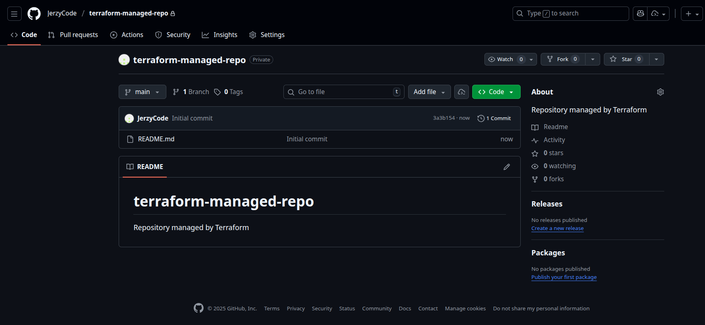

## 1. GitHub repository IaC setup


Created repository Command:

```
Do you want to perform these actions?
  Terraform will perform the actions described above.
  Only 'yes' will be accepted to approve.

  Enter a value: yes

github_repository.example: Creating...
github_repository.example: Creation complete after 5s [id=terraform-managed-repo]

Apply complete! Resources: 1 added, 0 changed, 0 destroyed.

Outputs:

repository_url = "https://github.com/JerzyCode/terraform-managed-repo"  
```

Screen:



Cleaned:

```
Do you really want to destroy all resources?
  Terraform will destroy all your managed infrastructure, as shown above.
  There is no undo. Only 'yes' will be accepted to confirm.

  Enter a value: yes

github_repository.example: Destroying... [id=terraform-managed-repo]
github_repository.example: Destruction complete after 1s

Destroy complete! Resources: 1 destroyed.
```

## Exercise 1

Files:
- outputs.tf
- repository.tf
- variables.tf


## 2. State management and remote backends

- added providers with s3 bucket
- created main.tf with ecr


Created .tfstate

```bash
jerzy-boksa@jerzyb-laptop:~$ aws s3 ls s3://jerzyb-s3-bucket-mlops-lab --recursive
2025-12-11 10:38:09       4022 mlops_app/terraform.tfstate

```