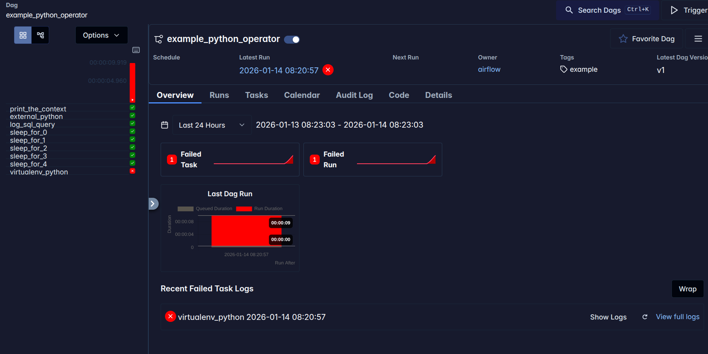
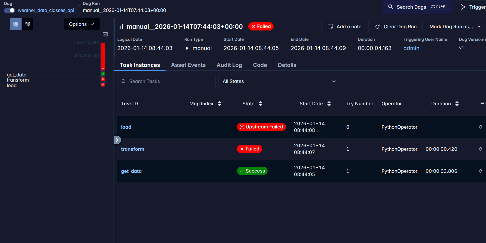
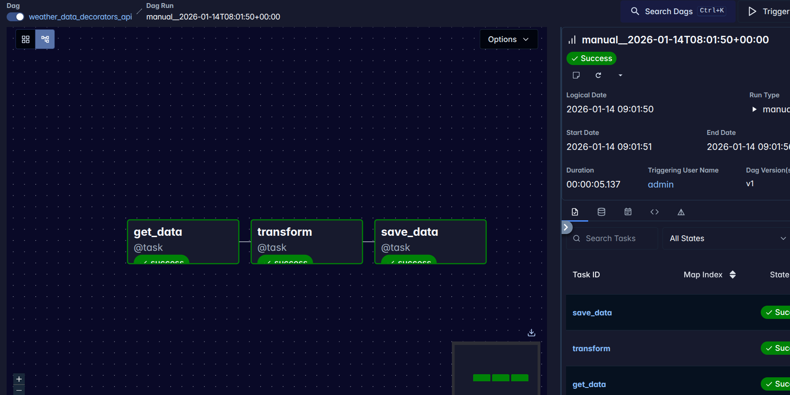
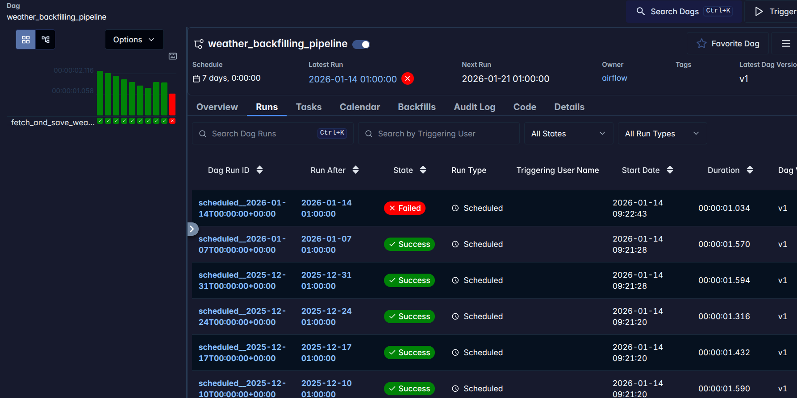
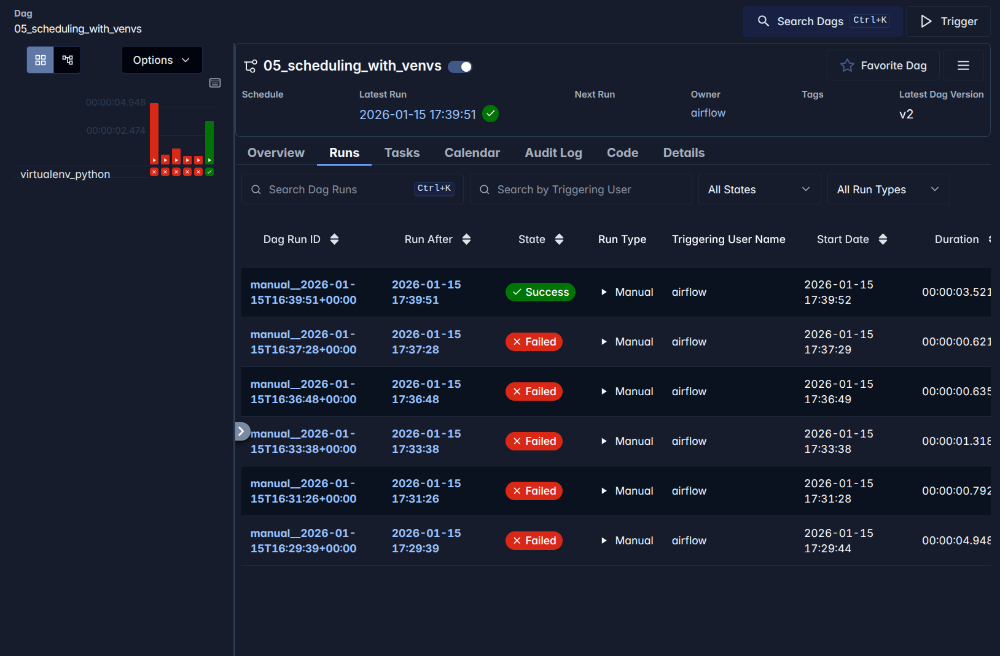
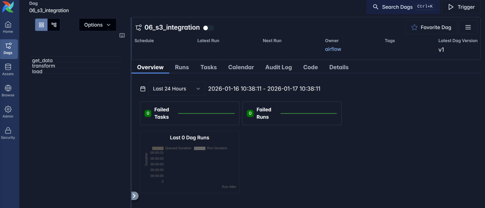
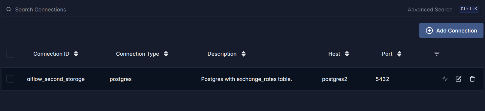

# Labolatory Part

## First run


Not working :(




## Pipe 01 

Pipe 1 - not working again :(


)

Found mistake: no pyarrow lib was included in pyproject.toml


## Exercise 1

Pipeline in file `02_class_pipeline.py`.




## Exercise 2

Code in file `04_backfilling.py`


The task were run. However, final task received bad request response code.




## Docker Airflow Deployment


## Exercise 3

Code for that exercise is in the `dags/05_scheduling_with_venvs.py` file.


After multiple tries, I was managed to run it fully with all libraries. 



**There was a problem** was with permissions with uv `$CACHE_DIR`. To solve it I found 2 solutions:

1. os.environ["UV_CACHE_DIR"] = "/tmp/uv-cache-airflow"
2. os.environ["UV_NO_CACHE"] = "1"


```bash
[2026-01-15 17:37:29] INFO - error: failed to open file `/opt/airflow/.uv-cache/CACHEDIR.TAG`: Permission denied (os error 13) source=airflow.providers.standard.utils.python_virtualenv loc=python_virtualenv.py:161
[2026-01-15 17:37:29] ERROR - Task failed with exception source=task loc=task_runner.py:1008
CalledProcessError: Command '['uv', 'venv', '--allow-existing', '--seed', '--python', 'python', '/tmp/venvdz5r6gig']' returned non-zero exit status 2.
File "/home/airflow/.local/lib/python3.11/site-packages/airflow/sdk/execution_time/task_runner.py", line 934 in run

File "/home/airflow/.local/lib/python3.11/site-packages/airflow/sdk/execution_time/task_runner.py", line 1325 in _execute_task

File "/home/airflow/.local/lib/python3.11/site-packages/airflow/sdk/bases/operator.py", line 417 in wrapper

File "/home/airflow/.local/lib/python3.11/site-packages/airflow/sdk/bases/decorator.py", line 252 in execute

File "/home/airflow/.local/lib/python3.11/site-packages/airflow/sdk/bases/operator.py", line 417 in wrapper

File "/home/airflow/.local/lib/python3.11/site-packages/airflow/providers/standard/operators/python.py", line 490 in execute

File "/home/airflow/.local/lib/python3.11/site-packages/airflow/sdk/bases/operator.py", line 417 in wrapper

File "/home/airflow/.local/lib/python3.11/site-packages/airflow/providers/standard/operators/python.py", line 215 in execute

File "/home/airflow/.local/lib/python3.11/site-packages/airflow/providers/standard/operators/python.py", line 896 in execute_callable

File "/home/airflow/.local/lib/python3.11/site-packages/airflow/providers/standard/operators/python.py", line 774 in _prepare_venv

File "/home/airflow/.local/lib/python3.11/site-packages/airflow/providers/standard/utils/python_virtualenv.py", line 205 in prepare_virtualenv

File "/home/airflow/.local/lib/python3.11/site-packages/airflow/providers/standard/utils/python_virtualenv.py", line 165 in _execute_in_subprocess

```


### Adding localstack

Successfully added a localstack with valid configuration to docker:

```bash
jerzy-boksa@jerzyb-laptop:~/Programming/Projects/university/term_3/mlops_agh_course/lab12$ aws --endpoint-url=http://localhost:4566 s3 ls
2026-01-17 09:55:19 airflow-xcom

```

### Running dag with localstack

Again after some fixes (url for s3 etc.) I was manage to run dag sucesfully.

Here are files on the s3:

```bash
jerzy-boksa@jerzyb-laptop:~/Programming/Projects/university/term_3/mlops_agh_course/lab12$ aws --endpoint-url=http://localhost:4566 s3 ls s3://airflow-xcom --recursive
2026-01-17 10:29:30     225537 xcom/weather_data_classes_api/manual__2026-01-17T09:29:18+00:00/get_data f1271ce7-3f70-4b64-a47e-2646f395ec97
2026-01-17 10:29:35     132244 xcom/weather_data_classes_api/manual__2026-01-17T09:29:18+00:00/transform/a46d0138-3bd1-4cd9-867a-4b7881da83a2
```


### Exercise 4

1) Made changes in `01-create-buckets.sh`
2) Rerun docker
3) Bucket list

```bash
jerzy-boksa@jerzyb-laptop:~/Programming/Projects/university/term_3/mlops_agh_course/lab12$ aws --endpoint-url=http://localhost:4566 s3 ls
2026-01-17 10:34:23 airflow-xcom
2026-01-17 10:34:26 weather-data
```

4) Created dag



5) After run there is file in s3 bucket:

```bash
jerzy-boksa@jerzyb-laptop:~/Programming/Projects/university/term_3/mlops_agh_course/lab12$ aws --endpoint-url=http://localhost:4566 s3 ls s3://weather-data --recursive
2026-01-17 10:39:28     190487 processed/weather_new_york_2025.csv
```


### Exercise 5

SQL and .env scripts were created.

**Added connection:**



After multiple fixes, managed to run dag successfully:

