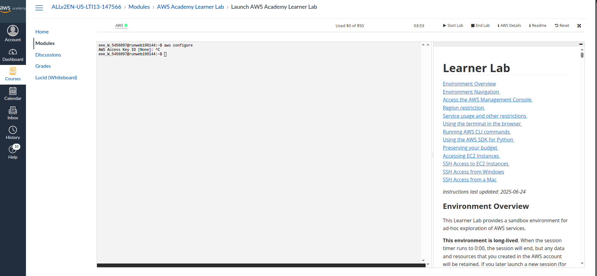
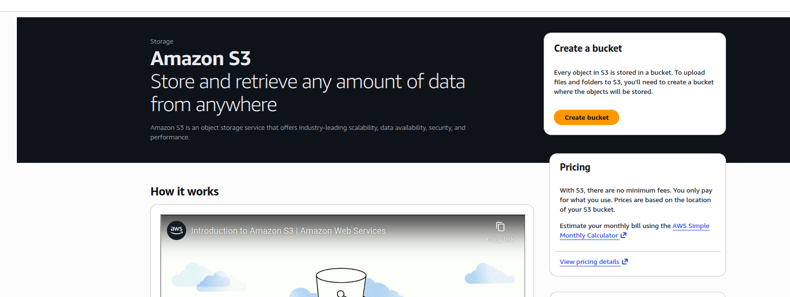
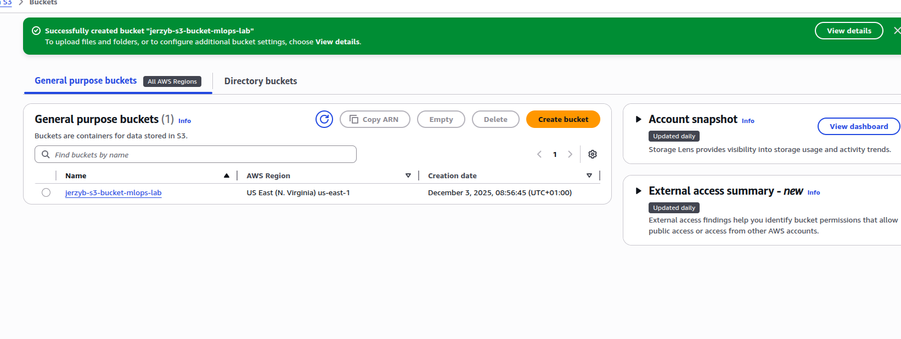
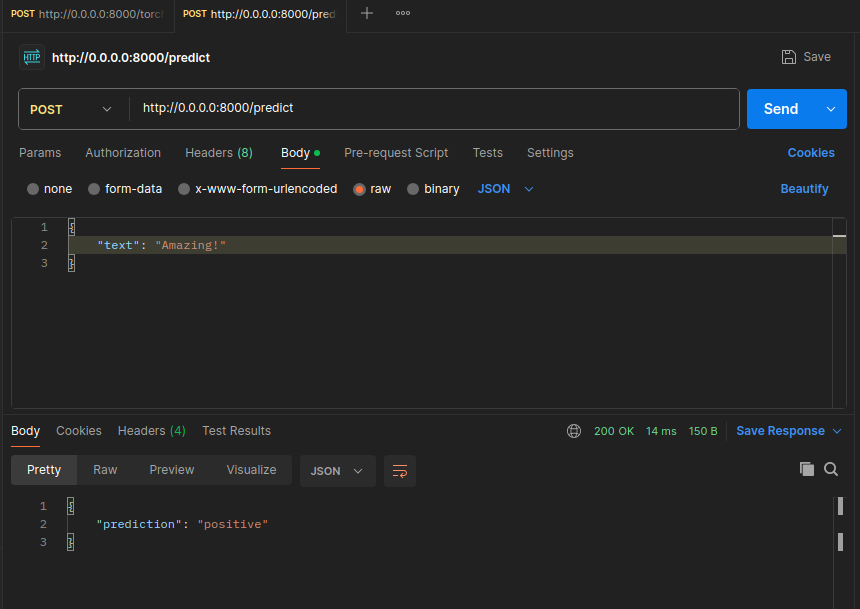

## 1. Identity and Access Management (IAM)

Skipping because I use AWS Academy account.

### 1.1, 1.2 Skip because AWS Academy


### 1.3 Connect to AWS using the CLI


Running:

```bash
$ curl "https://awscli.amazonaws.com/awscli-exe-linux-x86_64.zip" -o "awscliv2.zip"
unzip awscliv2.zip
sudo ./aws/install
```

Veryfi if installed.

```bash
jerzy-boksa@jerzyb-laptop:~/Apps/aws-cli$ aws --version
aws-cli/2.32.8 Python/3.13.9 Linux/6.14.0-36-generic exe/x86_64.ubuntu.24
```

Starting AWS Academy LAB.

Selecting "AWS Details" tab and copy from there aws_access_key etc. andp paste it to file ~/.aws/credentials




### 1.4 Skip because AWS Academy


## 2. Amazon S3 setup and file management


### 2.1 Create an S3 bucket



Bucket created:




### 2.2 Uploading file

```bash
jerzy-boksa@jerzyb-laptop:~/Programming/Projects/university/term_3/mlops_agh_course/lab9$ aws s3 cp models/mlops_model/ s3://jerzyb-s3-bucket-mlops-lab/mlops_model/ --recursive
```

Checking if uploaded

```bash
jerzy-boksa@jerzyb-laptop:~/Programming/Projects/university/term_3/mlops_agh_course/lab9$ aws s3 ls s3://jerzyb-s3-bucket-mlops-lab --recursive
2025-12-03 09:05:32     474781 mlops_model/classifier.joblib
2025-12-03 09:05:33        312 mlops_model/sentence_transformer.model/1_Pooling/config.json
2025-12-03 09:05:32      10454 mlops_model/sentence_transformer.model/README.md
2025-12-03 09:05:32        611 mlops_model/sentence_transformer.model/config.json
2025-12-03 09:05:32        283 mlops_model/sentence_transformer.model/config_sentence_transformers.json
2025-12-03 09:05:32   90864192 mlops_model/sentence_transformer.model/model.safetensors
2025-12-03 09:05:32        349 mlops_model/sentence_transformer.model/modules.json
2025-12-03 09:05:33         57 mlops_model/sentence_transformer.model/sentence_bert_config.json
2025-12-03 09:05:33        695 mlops_model/sentence_transformer.model/special_tokens_map.json
2025-12-03 09:05:32     711661 mlops_model/sentence_transformer.model/tokenizer.json
2025-12-03 09:05:32       1464 mlops_model/sentence_transformer.model/tokenizer_config.json
```


### 2.3 Integrate S3 into an ML workflow

Implementation of functions:

```python
def load_classifier_s3(bucket: str, key: str, path: str) -> LogisticRegression:
    log.info(f"Downloading classifier from S3: s3://{bucket}/{key}")

    os.makedirs(os.path.dirname(path), exist_ok=True)

    s3_client = boto3.client("s3")
    s3_client.download_file(bucket, key, path)

    log.info(f"Classifier downloaded to {path}")

    return load_classifier(path)


def load_text_embedder_s3(bucket_name: str, key: str, path: str) -> SentenceTransformer:
    log.info(f"Downloading sentence transformer from S3: s3://{bucket_name}/{key}")

    os.makedirs(path, exist_ok=True)
    s3_client = boto3.client("s3")

    paginator = s3_client.get_paginator("list_objects_v2")
    for page in paginator.paginate(Bucket=bucket_name, Prefix=key):
        if "Contents" in page:
            for obj in page["Contents"]:
                s3_key = obj["Key"]
                if s3_key.endswith("/"):
                    continue

                relative_path = s3_key.replace(key, "").lstrip("/")
                local_file = os.path.join(path, relative_path)

                os.makedirs(os.path.dirname(local_file), exist_ok=True)
                log.info(f"Downloading {s3_key} to {local_file}")
                s3_client.download_file(bucket_name, s3_key, local_file)

    log.info(f"Sentence transformer downloaded to {path}")
    return load_text_embedder(path)
```


Logs that proves that it was downloaded successfully:

```
2025-12-08 09:37:13,366 [INFO] Downloading sentence transformer from S3: s3://jerzyb-s3-bucket-mlops-lab/mlops_model/sentence_transformer.model
2025-12-08 09:37:13,380 [INFO] Found credentials in shared credentials file: ~/.aws/credentials
2025-12-08 09:37:14,107 [INFO] Downloading mlops_model/sentence_transformer.model/1_Pooling/config.json to model/sentence_transformer.model/1_Pooling/config.json
2025-12-08 09:37:14,511 [INFO] Downloading mlops_model/sentence_transformer.model/README.md to model/sentence_transformer.model/README.md
2025-12-08 09:37:14,921 [INFO] Downloading mlops_model/sentence_transformer.model/config.json to model/sentence_transformer.model/config.json
2025-12-08 09:37:15,330 [INFO] Downloading mlops_model/sentence_transformer.model/config_sentence_transformers.json to model/sentence_transformer.model/config_sentence_transformers.json
2025-12-08 09:37:15,741 [INFO] Downloading mlops_model/sentence_transformer.model/model.safetensors to model/sentence_transformer.model/model.safetensors
2025-12-08 09:37:26,703 [INFO] Downloading mlops_model/sentence_transformer.model/modules.json to model/sentence_transformer.model/modules.json
2025-12-08 09:37:27,109 [INFO] Downloading mlops_model/sentence_transformer.model/sentence_bert_config.json to model/sentence_transformer.model/sentence_bert_config.json
2025-12-08 09:37:27,589 [INFO] Downloading mlops_model/sentence_transformer.model/special_tokens_map.json to model/sentence_transformer.model/special_tokens_map.json
2025-12-08 09:37:28,046 [INFO] Downloading mlops_model/sentence_transformer.model/tokenizer.json to model/sentence_transformer.model/tokenizer.json
2025-12-08 09:37:29,429 [INFO] Downloading mlops_model/sentence_transformer.model/tokenizer_config.json to model/sentence_transformer.model/tokenizer_config.json
2025-12-08 09:37:29,769 [INFO] Downloading mlops_model/sentence_transformer.model/vocab.txt to model/sentence_transformer.model/vocab.txt
2025-12-08 09:37:30,176 [INFO] Sentence transformer downloaded to model/sentence_transformer.model
```


Screen from api call:

4

## 3. Elastic Container Registry (ECR) & Docker management

